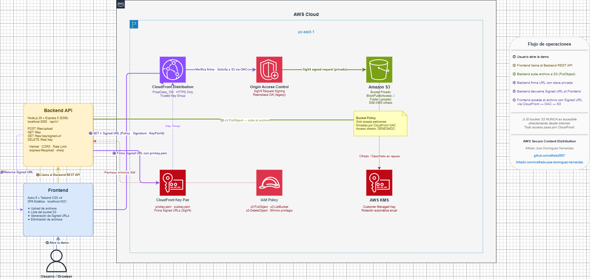

# Arquitectura 01 — CDN Privada Segura

## Problema

Entregar archivos privados de forma segura y eficiente a nivel global sin exponer el bucket S3 directamente al público.

## Solución

CloudFront + S3 con Signed URLs y Origin Access Control (OAC).

## Diagrama

## Servicios AWS

| Servicio   | Rol                                        |
|------------|--------------------------------------------|
| Amazon S3  | Almacenamiento privado de objetos          |
| CloudFront | Distribución CDN global con edge caching   |
| Signed URLs| Acceso temporal y controlado por usuario   |
| IAM        | Políticas de acceso con mínimo privilegio  |
| KMS        | Cifrado del bucket (opcional, SSE-KMS)     |

## Decisiones Técnicas

- [ADR-001: OAC en lugar de OAI](../../docs/decisions/ADR-001-cloudfront-oac-vs-oai.md)

## Consideraciones

### Seguridad
- Bucket completamente privado (`BlockPublicAccess: true`)
- Signed URLs con expiración configurable (recomendado: 15 min para descargas, 1h para streams)
- CloudFront key pair gestionado con Secrets Manager

### Costo
- CloudFront: ~$0.0085/GB (transferencia) + $0.0075/10k HTTPS requests
- S3: ~$0.023/GB almacenamiento, $0.0004/1k GET requests (solo desde CloudFront)

### Escalabilidad
- CloudFront escala automáticamente a cualquier nivel de tráfico
- Cache hit rate objetivo: >80% para reducir costos de origen

## Demo

Ubicación: [`../../demos/signed-url-demo/`](../../demos/signed-url-demo/)

**Flujo:**
1. Usuario autentica → backend genera Signed URL con expiración
2. Usuario accede al archivo via Signed URL
3. CloudFront valida firma → sirve desde edge cache o fetches desde S3

## Estado

- [x] Diagrama arquitectural
- [ ] IaC Terraform en `../../infrastructure/terraform/`
- [ ] Demo funcional
- [ ] ADR adicionales documentados
