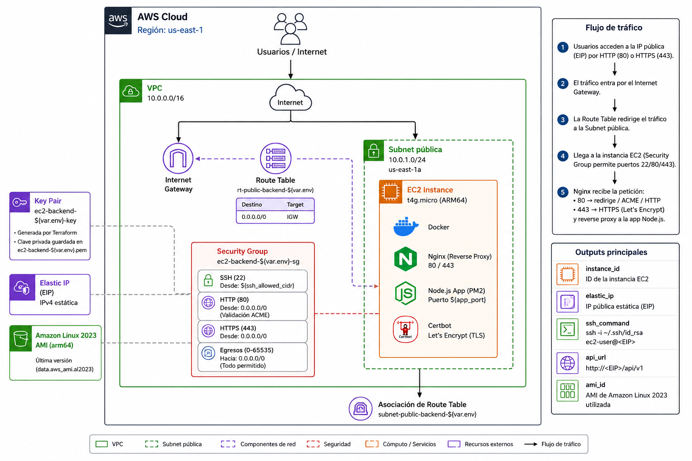

# Arquitectura 04 — Backend Containerizado en EC2

## Problema

Ejecutar una o más APIs Node.js en contenedores Docker sobre una instancia EC2 de bajo costo, con HTTPS automático por subdominio y despliegues sin downtime, sin la complejidad operacional de ECS/Fargate.

## Solución

EC2 t4g.micro (Graviton2, Free Tier) con Docker + Nginx como reverse proxy + Certbot para SSL/TLS automático via Let's Encrypt. Terraform genera el key pair ED25519, provisiona la red mínima y deja la instancia lista para recibir contenedores con dos scripts operacionales.

## Diagrama



```
Internet
  │
  ▼ :443 / :80
Elastic IP (estática)
  │
  ▼
EC2 t4g.micro — Amazon Linux 2023 (ARM64)
  ├── Nginx (reverse proxy)
  │     ├── api1.dominio.dev  → Docker container :3001
  │     ├── api2.dominio.dev  → Docker container :3002
  │     └── ...
  └── Certbot (Let's Encrypt — renovación automática)

VPC 10.0.0.0/16
  └── Subnet pública 10.0.1.0/24 (us-east-1a)
        └── Security Group: 22 (SSH), 80 (HTTP), 443 (HTTPS)
```

## Servicios AWS

| Servicio         | Rol                                                        |
| ---------------- | ---------------------------------------------------------- |
| EC2 t4g.micro    | Instancia Graviton2 ARM64, Free Tier actual (cuentas 2024+)|
| Elastic IP       | IP pública estática para resolución DNS estable            |
| VPC + Subnet     | Red aislada con subred pública en us-east-1a               |
| Internet Gateway | Salida a internet para tráfico público y Docker pulls      |
| Security Group   | Firewall de instancia (22 / 80 / 443)                      |
| Key Pair         | Par de claves ED25519 generado automáticamente por Terraform|
| AMI              | Amazon Linux 2023 ARM64 (última versión, selección dinámica)|

## Stack en la instancia

| Componente | Versión    | Propósito                                       |
| ---------- | ---------- | ----------------------------------------------- |
| Docker     | Latest dnf | Ejecutar los contenedores de las APIs            |
| Nginx      | Latest dnf | Reverse proxy + terminación TLS por subdominio  |
| Certbot    | Latest dnf | Provisionamiento automático de certificados SSL  |

## Decisiones Técnicas

- [ADR-002: ECS Fargate vs EC2](../../docs/decisions/ADR-002-ecs-fargate-vs-ec2.md) — por qué EC2 directo es preferible para cargas predecibles de bajo volumen.

## Prerrequisitos

- Terraform >= 1.4.0
- AWS CLI configurado con el perfil `leader-developer-personal`
- Registro DNS del subdominio apuntando a la Elastic IP **antes** de ejecutar `add-api.sh`

## Variables

| Variable          | Tipo   | Default       | Descripción                                         |
| ----------------- | ------ | ------------- | --------------------------------------------------- |
| `env`             | string | `"dev"`       | Sufijo de entorno para nombres de recursos          |
| `domain`          | string | —             | Subdominio completo (p.ej. `api.alfredo-dominguez.dev`) |
| `ssh_allowed_cidr`| string | `"0.0.0.0/0"` | CIDR para acceso SSH — restringir a tu IP en producción |
| `app_port`        | number | `3000`        | Puerto interno del contenedor Node.js               |

Copia `terraform.tfvars.example` como `terraform.tfvars` y completa los valores:

```hcl
env              = "dev"
domain           = "api.alfredo-dominguez.dev"
ssh_allowed_cidr = "203.0.113.10/32"   # reemplaza con tu IP: curl ifconfig.me
app_port         = 3000
```

## Despliegue

```bash
cd infrastructure/terraform/04-container-backend

terraform init
terraform plan
terraform apply
```

Terraform crea la clave privada en `ec2-backend-dev.pem` (permisos `0600`) y devuelve:

```
instance_id  = "i-0xxxxxxxxxxxxxxxxx"
elastic_ip   = "X.X.X.X"
ssh_command  = "ssh -i ec2-backend-dev.pem ec2-user@X.X.X.X"
api_url      = "http://X.X.X.X/api/v1"
ami_id       = "ami-xxxxxxxxxxxxxxxxx"
```

## Operación — Scripts incluidos

### `deploy.sh` — Desplegar o actualizar un contenedor

```bash
./deploy.sh <imagen> <nombre_contenedor> <puerto_host>
```

Ejemplo:

```bash
./deploy.sh ghcr.io/org/my-api:latest my-api 3001
```

- Detiene y elimina el contenedor anterior con el mismo nombre.
- Carga variables de entorno desde `/home/ec2-user/.env.<nombre_contenedor>` o `.env` como fallback.
- Monta `/home/ec2-user/key` como volumen de solo lectura para el contenedor.
- Política de reinicio: `unless-stopped`.
- Ejecuta `docker image prune` al finalizar.

### `add-api.sh` — Registrar subdominio + SSL

```bash
./add-api.sh <subdominio_completo> <puerto_host> [email]
```

Ejemplo:

```bash
./add-api.sh api.alfredo-dominguez.dev 3001
```

- Crea el virtual host en `/etc/nginx/conf.d/<subdominio>.conf`.
- Recarga Nginx.
- Provisiona el certificado SSL con Certbot + redirección HTTP→HTTPS automática.
- Requiere que el DNS del subdominio ya apunte a la Elastic IP.

## Consideraciones

### Seguridad

- Volumen raíz cifrado (gp3, `encrypted = true`).
- Par de claves ED25519 generado en tiempo de `terraform apply` — nunca se sube ninguna clave pública preexistente.
- Restringir `ssh_allowed_cidr` a tu IP pública en entornos de producción.
- Puerto 80 abierto únicamente para la validación ACME de Let's Encrypt; todo el tráfico de aplicación viaja por HTTPS.

### Costo

- EC2 t4g.micro: **gratis** bajo Free Tier (750 h/mes en cuentas elegibles 2024+)
- Elastic IP: ~$0.005/hora si **no** está asociada a una instancia en ejecución
- EBS gp3 30 GB: ~$2.40/mes
- Transferencia de datos saliente: $0.09/GB (primeros 100 GB/mes gratuitos)

### Escalabilidad

Este patrón es adecuado para cargas de trabajo de bajo-medio volumen. Para escalar horizontalmente considera migrar a la [Arquitectura 02 — Backend Escalable con ECS Fargate](../02-scalable-backend/readme.md).

- Múltiples APIs pueden correr en paralelo en diferentes puertos del host.
- El límite práctico es la CPU/memoria de la instancia (t4g.micro: 2 vCPU, 1 GB RAM).
- Upgrade de instancia: cambiar `instance_type` en `main.tf` y re-aplicar.

## Estado

- [x] Diagrama arquitectural
- [x] IaC Terraform completo (`main.tf`)
- [x] Script de despliegue (`user_data.sh` → `deploy.sh`, `add-api.sh`)
- [x] Variables de ejemplo (`terraform.tfvars.example`)
- [ ] Demo funcional documentada
- [ ] ADR adicionales
